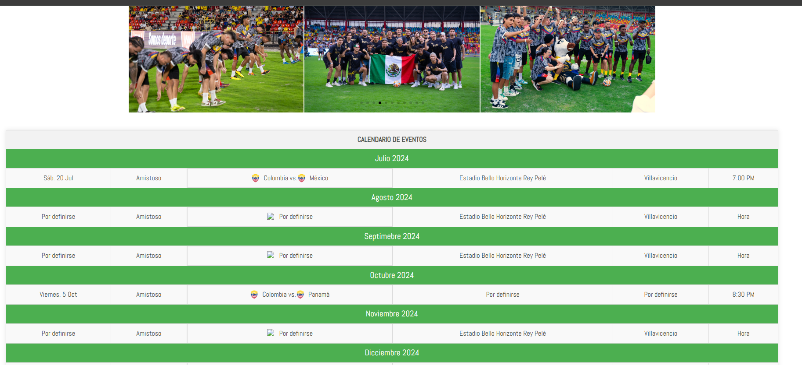
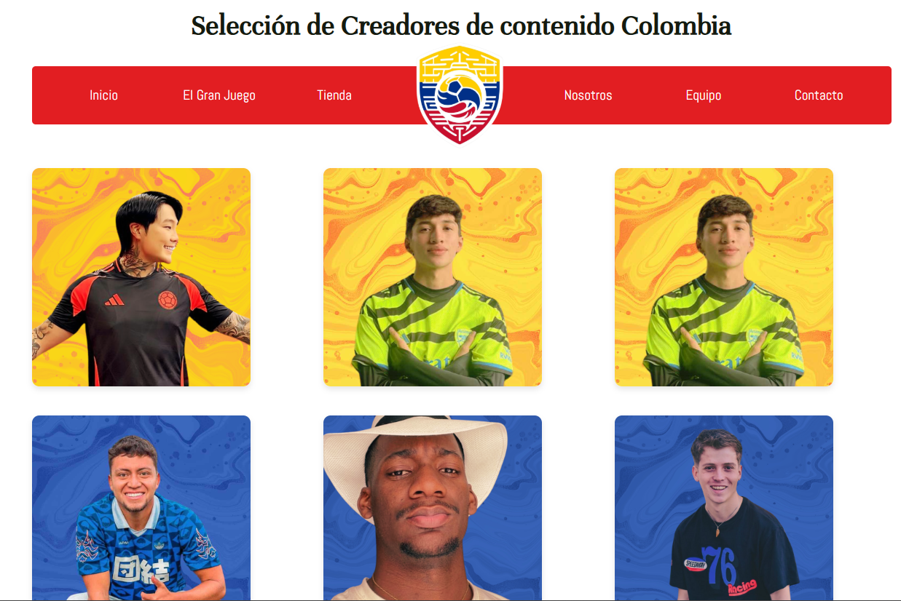
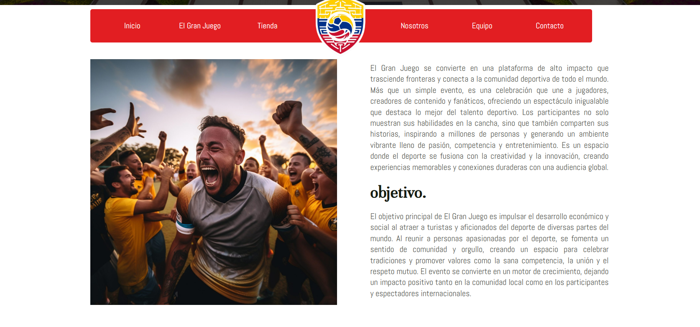
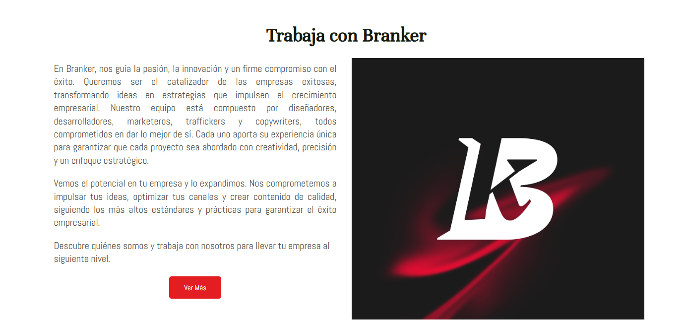

# Selección de Creadores — Proyecto Branker

Sitio web promocional desarrollado para Branker como parte de una campaña de convocatoria de **creadores de contenido deportivo**. El proyecto busca destacar el talento nacional e internacional mediante eventos deportivos, campañas visuales y experiencias digitales interactivas.

🔗 **Demo en línea:** [https://branker.co/seleccioncreadores/](https://branker.co/seleccioncreadores/)

---

## 🏟 Descripción del proyecto

El sitio fue diseñado con un enfoque visual moderno y dinámico, con el objetivo de:

- Conectar talentos digitales con oportunidades de colaboración.
- Visibilizar el evento “**El Gran Juego**”, un encuentro internacional de creadores de contenido y deportistas.
- Mostrar el equipo participante y brindar información clave sobre la convocatoria.

---

## ✨ Funcionalidades destacadas

- **Sección de bienvenida** con banner visual e información del evento.
- **Presentación del equipo** con diseño colorido y atractivo.
- **Sección de convocatoria** que explica el objetivo e impacto del proyecto.
- **Galería de imágenes** de los encuentros entre Colombia y México.
- **Calendario interactivo** de eventos deportivos próximos.
- **Sección “Trabaja con Branker”** para fomentar colaboraciones futuras.

---

## 🖼 Capturas del sitio

A continuación se muestran algunas vistas del sitio:

### Página de inicio – Banner principal

### Galería de participantes

### Sección "Trabaja con Branker"

### Descripción del evento "El Gran Juego"

### Presentación del equipo

### Encuentro Colombia vs México

### Calendario de próximos eventos

---

## 🚀 Tecnologías utilizadas

- **HTML5**
- **CSS3**
- **JavaScript**
- **Diseño responsivo**
- **Animaciones y efectos visuales**

---

## 👨‍💻 Desarrollado por

Jhon Stewar Moreno Murillo — [Perfil GitHub](https://github.com/jarammmm1999)

---

