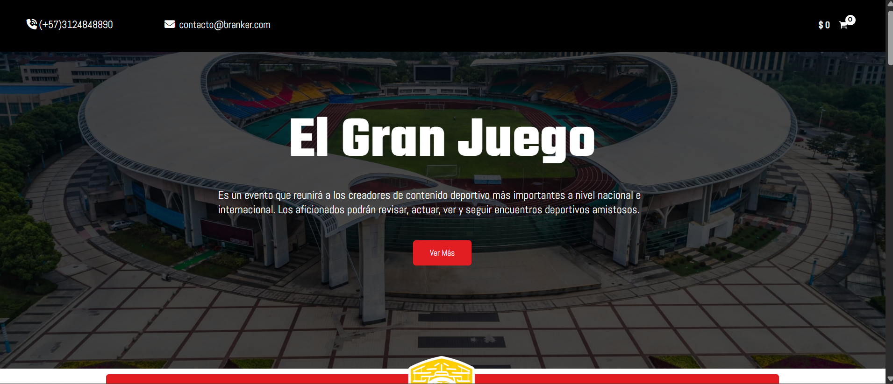
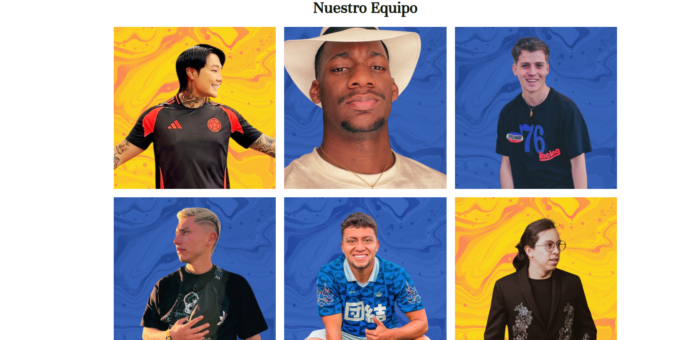

# Selección de Creadores — Proyecto Branker

Sitio web promovido por Branker para la convocatoria de creadores de contenido. Diseñado para conectar talentos digitales con oportunidades, musicalizado con elementos visuales dinámicos.

🌐 Demo: [https://branker.co/seleccioncreadores/](https://branker.co/seleccioncreadores/)

---

## 🎯 Objetivos

- Mostrar una plataforma amigable para inscribir y seleccionar creadores de contenido.
- Promover la interacción entre aspirantes y el equipo de Branker.
- Presentar contenido multimedia (video, imágenes, formularios) con estilo moderno.

---

## 🚀 Mi rol

- Personalización del tema en **WordPress**.
- Maquetación responsiva de landing page.
- Integración y configuración de formularios de inscripción.
- Optimización de UX (diseño visual, tiempos de carga y experiencia móvil).

---

## 🛠️ Tecnologías utilizadas

- WordPress
- HTML5 / CSS3 / JavaScript
- Plugins: Elementor (u otros) y formularios personalizados
- Imágenes optimizadas y media queries

---

## 🖼️ Capturas

  
*Pantalla principal con banner y sección de inscripción.*

  
*Formulario optimizado para móviles y desktop.*

---

## ✅ Resultados

- Alta tasa de conversión en inscripciones (según datos internos de Branker).
- Presentación visual profesional y alineada con la marca de la convocatoria.
- Sitio funcional y preparado para campañas y promociones futuras.

---

## 👤 Autor

**Jhon Stewar Moreno Murillo**  
Desarrollador Web Junior  
[GitHub: jarammmm1999](https://github.com/jarammmm1999)  
